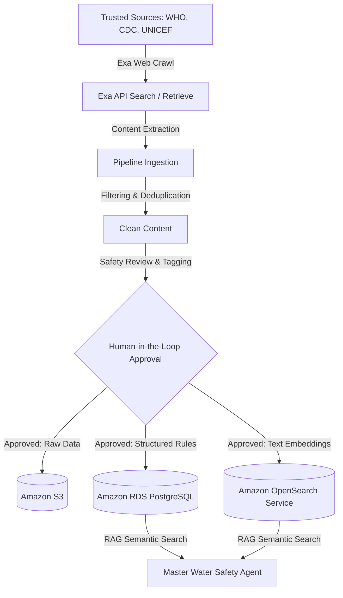
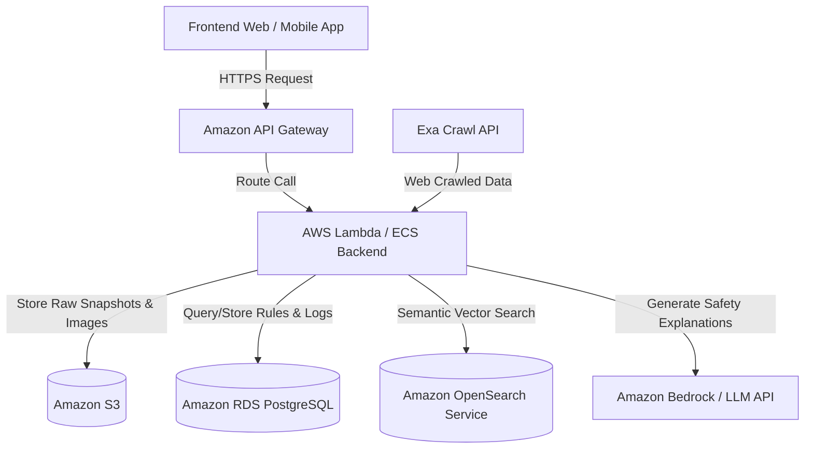
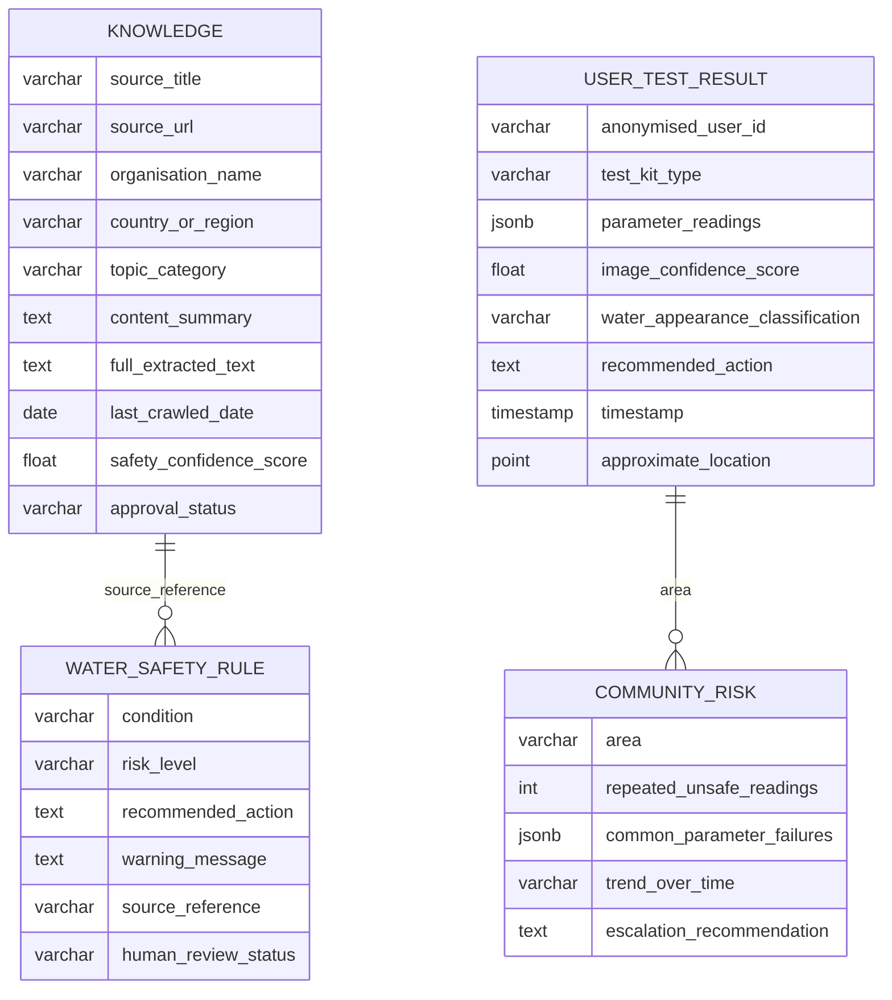
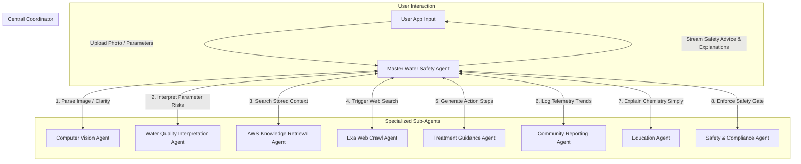

### Proposed Scaffolding

```text
water-for-all/
├── .env.example                # Blueprint for system keys (AWS, EXA, OPENAI/BEDROCK)
├── .gitignore                  # Strict filters blocking environment secrets, caches, and logs
├── agents.md                   # Master file defining the 9-agent orchestration system
├── README.md                   # Minimal deployment guides and core architectural summary
├── docs/
│   ├── plan.md                 # Technical execution roadmap with phase-by-phase success criteria
│   └── schema.json             # DB structures (Knowledge, Safety Rules, Results, Risk Tables)
├── infra/                      # Infrastructure as Code (AWS CDK, Terraform, or CloudFormation)
│   ├── aws_stack.tf            # Provisions S3, RDS PostgreSQL, OpenSearch, and API Gateway
│   └── docker/
│       ├── backend.Dockerfile  # Multi-stage production container utilizing uv package manager
│       └── frontend.Dockerfile # Standardized deployment engine for the dashboard app
├── frontend/                   # Web / Mobile user interface (Next.js or React Native)
│   ├── package.json            # Client dependencies and build scripts
│   └── src/                    # UI elements for image uploads and the community risk view
└── backend/                    # Core Python multi-agent logic and analytics engine
    ├── pyproject.toml          # Package spec handled via uv (boto3, opensearch-py, exa-py, pillow)
    ├── uv.lock                 # Deterministic dependency tree locking execution layers
    ├── data/                   # Reference engineering matrices and local mock parameters
    │   ├── raw/                # Baseline test strip images and calibration cards
    │   └── processed/          # Cleaned training sets or local transient configurations
    └── src/
        ├── main.py             # FastAPI entrypoint mapping routes to AWS API Gateway targets
        ├── agents/             # The 9 specified operational multi-agent blueprints
        │   ├── master_agent.py          # Central orchestrator handling final user responses
        │   ├── cv_agent.py              # Vision engine processing strips and clarity
        │   ├── interpretation_agent.py  # Classifies parameters into safety threat tiers
        │   ├── aws_retrieval_agent.py   # Runs semantic vector search queries on OpenSearch
        │   ├── exa_crawl_agent.py       # Dispatches live web crawl alerts for missing data
        │   ├── treatment_agent.py       # Formulates purification / boiling action items
        │   ├── reporting_agent.py       # Analyzes regional trends and aggregates hotspots
        │   ├── education_agent.py       # Translates complex chemistry into clear guidelines
        │   └── safety_agent.py          # Hard gate blocking toxic advice (e.g., boiling chemical contamination)
        ├── tools/              # Discrete infrastructure instruments executed by agents
        │   ├── s3_client.py             # Manages file streaming for image snapshots
        │   ├── rds_client.py            # Executes relational SQL queries against PostgreSQL
        │   ├── opensearch_client.py     # Converts text to embeddings and performs RAG lookup
        │   ├── cv_engine.py             # Evaluates RGB test strip color-matching vectors
        │   └── exa_search.py            # Interfaces with the Exa Search and Retrieval API
        └── pipelines/          # Asynchronous data processing jobs
            ├── ingest_knowledge.py      # Extract, deduplicate, filter, and tag crawled sources
            └── aggregate_analytics.py   # Processes regional failures for local NGO reports
```

---

## Technical Architecture

The WaterForAll system is built upon a six-tier architecture that integrates edge telemetry, multi-agent coordination, and cloud storage:

### Frontend Web / Mobile App
- Upload water image
- Upload test kit image
- Show results and advice
- Show community risk dashboard

### Backend API
- Receives image and user input
- Calls computer vision model
- Calls master agent
- Stores results in AWS

### Computer Vision Layer
- Test strip color detection
- Reference chart comparison
- Water clarity detection
- Image quality confidence score

### Agentic AI Layer
- Master Water Safety Agent
- Computer Vision Agent
- Water Quality Interpretation Agent
- AWS Knowledge Retrieval Agent
- Exa Web Crawl Agent
- Treatment Guidance Agent
- Community Reporting Agent
- Education Agent
- Safety and Compliance Agent


### Knowledge Layer
- Exa crawls trusted web sources
- Raw content stored in Amazon S3
- Structured knowledge stored in Amazon RDS PostgreSQL
- Embeddings stored in Amazon OpenSearch
- Safety rules stored in database tables

### Analytics Layer
- Community-level unsafe water trends
- Repeated parameter failures
- Location-based risk hotspots
- Reports for NGOs or local agencies

---

## Exa and AWS Knowledge Layer

A key part of WaterForAll is the safe drinking water knowledge base.

We will use Exa to crawl and retrieve trusted web content related to safe drinking water, household water treatment, emergency water safety, boiling guidance, filtration methods, test kit interpretation, chemical contamination warnings, and safe water storage. The crawler should prioritise authoritative sources such as WHO, CDC, UNICEF, government water agencies, public health departments, NGOs, and recognised humanitarian organisations.

The crawled content will not be used blindly. It will go through a knowledge ingestion pipeline before being stored in AWS.



The AWS database will act as the system’s source of truth for safe-drinking-water knowledge and user records.

For the MVP, the AWS architecture can be:



---

### Database Schema Design

The database stores both structured and unstructured knowledge.



This allows the master agent to give advice that is not just based on the LLM’s general knowledge, but based on retrieved, cited, curated and stored public health knowledge.

---

## Updated Agent Architecture

The system will be designed as a master water safety agent supported by specialised sub-agents.



The full set of agents includes:

### 1. Master Water Safety Agent
Coordinates all agents and produces the final user-friendly recommendation.

### 2. Computer Vision Agent
Reads the water test kit, detects water appearance, checks image quality and estimates confidence.

### 3. Water Quality Interpretation Agent
Maps test kit readings to simple categories such as safe, caution, unsafe or requires laboratory testing.

### 4. AWS Knowledge Retrieval Agent
Searches the stored safe drinking water knowledge base in Amazon RDS and OpenSearch.

### 5. Exa Web Crawl Agent
Searches and crawls trusted public sources when the database does not have enough information or when guidance needs updating.

### 6. Treatment Guidance Agent
Suggests practical next steps such as settling, filtering, boiling, safe storage, or avoiding the water.

### 7. Community Reporting Agent
Stores anonymised results and identifies repeated unsafe readings in the same area.

### 8. Education Agent
Explains water safety concepts in simple language.

### 9. Safety and Compliance Agent
Prevents the system from giving unsafe advice, such as saying chemically contaminated water is safe after boiling.

---

## Hackathon Judging Criteria Alignment

### 1. Agent Overview
- **Agents Built**: A cooperative multi-agent system led by the Master Water Safety Agent, supported by 8 specialized sub-agents: Computer Vision, Water Quality Interpretation, AWS Knowledge Retrieval, Exa Web Crawl, Treatment Guidance, Community Reporting, Education, and Safety & Compliance.
- **Purpose**: Provides low-cost, AI-assisted water safety checks and practical treatment instructions for communities with limited access to laboratories, using photos of simple test strips.

### 2. Autonomy & Decision-Making
- **Reasoning Loop**: Specialized agents operate within a Plan-Execute-Reflect loop.
- **Dynamic Routing**: The Master Agent dynamically plans execution paths based on data availability, invoking the Exa Web Crawl Agent only when cached AWS knowledge retrieval is insufficient for a particular contaminant or region.

### 3. Actions & Tool Use
- **Actions**: Vision-based test strip color parsing, RAG query vector matching, automated web crawling, structured database operations, and real-time streaming explanation generation.
- **Tools**:
  - `cv_engine.py`: Parses RGB values of test strips and evaluates water clarity.
  - `opensearch_client.py`: Vector search on Amazon OpenSearch embeddings.
  - `rds_client.py`: PostgreSQL queries and inserts for rules, results, and risk tables.
  - `exa_search.py`: Trusted web source scraping using the Exa API.
  - `s3_client.py`: Stores raw crawl files and user images.

### 4. Orchestration
- **Topology**: Hub-and-Spoke model.
- **Communication**: All sub-agents route messages strictly through the central Master Agent using structured JSON control payloads to ensure predictable execution chains.

### 5. Human-in-the-Loop
- **Manual Overrides**: Operators can manually adjust detected test strip parameters via dashboard controls.
- **Data Governance**: Community risk escalations and newly crawled guidelines are stored with a "pending review" status, requiring admin approval before becoming active rules.

### 6. Failure Handling
- **Offline Fallback**: If external API endpoints (LLM or Exa API) time out, the system catches the exception and downgrades to local mathematical and rule-based evaluation.
- **Vision Exception Recovery**: If the photo is blurry or unreadable, the Computer Vision Agent triggers a UI exception, prompting the user to input parameters manually via UI sliders.

### 7. Demo & Presentation
- **User Interface**: Streamlit/Web dashboard with dark theme and Water Blue Primary (#209dd7).
- **Interactive Scenarios**: Presenters can select preset scenarios (e.g., Safe Water, Microbiological Outbreak, Chemical Spill) to immediately demonstrate the end-to-end multi-agent orchestration, database logging, and streaming guidance.

