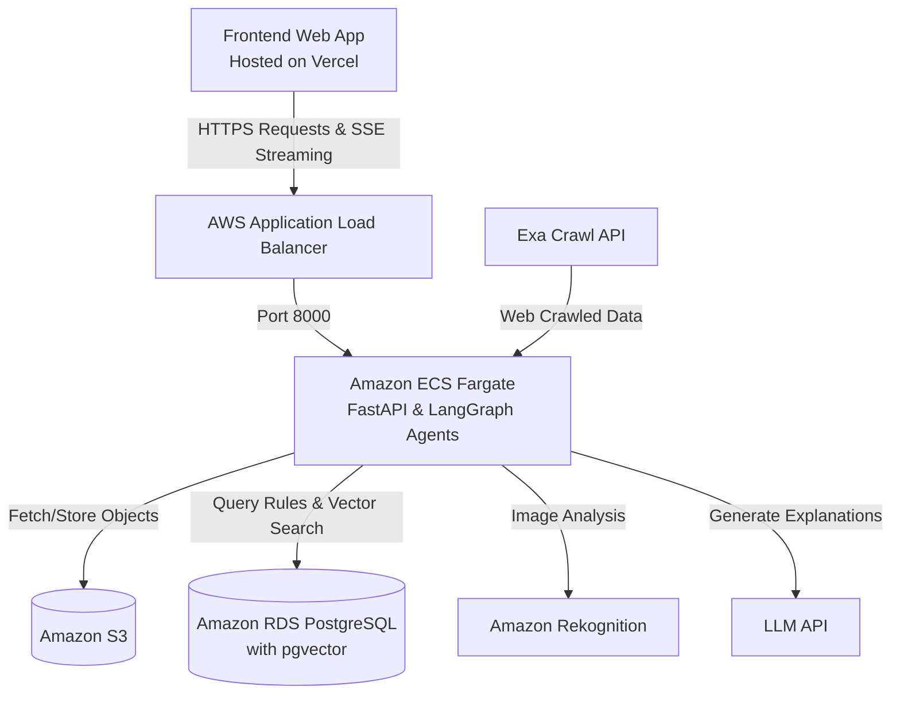
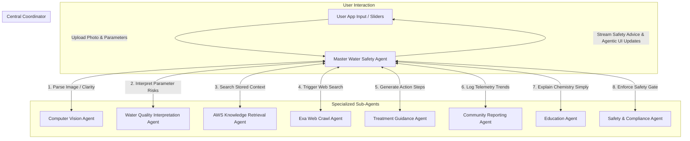
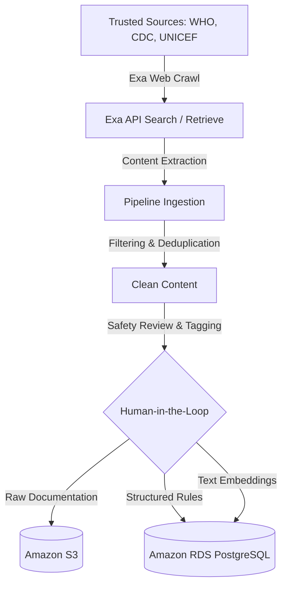
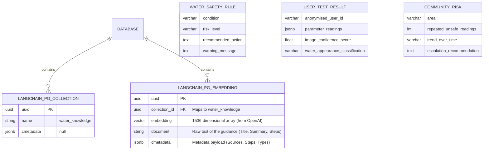

# WaterForAll: Agentic Water Safety Assistant

Link here: https://waterforall.vercel.app/ 

Presentation here: https://docs.google.com/presentation/d/1w-Vy2qsOnBcAD_Tf4H7KYE-eoyRj9Ezdwz0UV41TZAM/edit?usp=sharing 

## Project Overview

WaterForAll is a low-cost, AI-assisted water safety assistant for communities that do not have frequent or reliable access to clean drinking water. The solution combines affordable drinking water test kits, mobile phone photos, computer vision, agentic AI, Exa web crawling, and an AWS-hosted knowledge database.

The aim is to help users perform first-level water safety checks, understand possible risks, and receive practical next-step guidance such as filtering, boiling, safe storage, or escalating for proper laboratory testing.

---

## Workspace & Scaffolding

```text
water-for-all/
├── .env.example                # Blueprint for system keys (AWS, EXA, OPENAI)
├── agents.md                   # Master file defining the 9-agent orchestration system
├── README.md                   # Deployment guides and core architectural summary
├── docs/                       # Project planning, schema, and deployment runbooks
├── src/
│   ├── frontend/               # Next.js / React Web Application (Deployed to Vercel)
│   │   ├── package.json
│   │   └── src/components/     # UI elements, chat interface, and parameter sliders
│   └── backend/                # Core Python FastAPI backend & LangGraph Agents (Deployed to AWS)
│       ├── pyproject.toml      # Package spec managed via uv
│       ├── uv.lock             # Deterministic dependency tree
│       ├── pipelines/          # Data ingestion and automation jobs
│       ├── tools/              # Tools for S3, RDS, Exa, and CV (Rekognition)
│       └── agents/             # The 9 LangGraph operational multi-agent blueprints
```

---

## System Architecture & Deployment

The system is split between a **Vercel**-hosted frontend and an **AWS**-hosted serverless backend, engineered to support long-lived real-time streaming and robust multi-agent orchestration.

### Cloud Infrastructure Components

| Layer | Component | Service / Technology | Description |
| --- | --- | --- | --- |
| **Frontend** | Web Application | **Vercel (Next.js, React)** | Hosts the highly polished user interface and chat assistant. Automatically deployed directly from GitHub. |
| **Traffic Routing**| Load Balancer | **AWS Application Load Balancer (ALB)** | Replaces API Gateway to natively support long-lived Server-Sent Events (SSE) connections required for real-time chat streaming. |
| **Compute** | Backend API | **Amazon ECS Fargate** | Runs the containerized Python FastAPI backend and LangGraph orchestration without managing underlying servers. |
| **Database & RAG**| Relational & Vector DB | **Amazon RDS PostgreSQL** (with `pgvector`) | Acts as the system's central source of truth. Stores structured safety rules, community telemetry, and vector embeddings for semantic search. |
| **Storage** | Object Storage | **Amazon S3** | Securely stores raw crawled documents, snapshots, and user test kit photos. |
| **AI / CV** | Vision Engine | **Amazon Rekognition** | Processes RGB test strip color-matching vectors and water clarity checks. |
| **Security & Auth**| Identity & Secrets | **AWS IAM & Secrets Manager** | ECS Task Roles grant secure container access to services without hardcoded keys. Secrets Manager stores external API keys (OpenAI, Exa). |
| **Registry** | Docker Repository | **Amazon ECR** | Stores the production backend container image. |

### Architecture Diagram



---

## Instructions to Host on Docker

Follow these simple steps to run the application on your own computer. You don't need any coding experience!

**Step 1: Install Docker Desktop**
1. Go to [Docker's official website](https://www.docker.com/products/docker-desktop/) and download Docker Desktop for your operating system (Windows or Mac).
2. Install the application and open it. Ensure Docker is running (you should see a whale icon in your system tray or menu bar).

**Step 2: Download the Project**
1. Download this project code to your computer (if you are on GitHub, click the green **"Code"** button and select **"Download ZIP"**).
2. Extract the ZIP file to a folder on your desktop or documents.

**Step 3: Add Your Secret Keys**
1. Open the extracted `water-for-all` folder. 
2. Find the file named `.env.example` and rename it to exactly `.env` (make sure your computer doesn't accidentally save it as `.env.txt`).
3. Open the `.env` file in a text editor (like Notepad or TextEdit) and fill in your API keys (like `OPENAI_API_KEY` and `EXA_API_KEY`). Save and close the file.

**Step 4: Start the Server**
1. Open the `scripts` folder inside the project.
2. **If you are on Windows:** Double-click the `start-server.bat` file.
3. **If you are on Mac/Linux:** Open your terminal, navigate to the `scripts` folder, and run `sh start-server.sh`.
*(Note: The very first time you do this, it may take 5–10 minutes to download and build the system. Please be patient!)*

**Step 5: Open the App**
1. Once the setup completes, open your web browser (Chrome, Edge, Safari).
2. Go to **[http://localhost:3000](http://localhost:3000)** to view the frontend application.
3. To shut down the app later, simply run the `stop-server` script in the `scripts` folder.

---

## Agentic AI Orchestration

The system is designed as a master water safety agent supported by specialized sub-agents, orchestrated using **LangGraph**. All sub-agents route messages strictly through the central Master Agent using structured JSON control payloads, avoiding unpredictable global broadcasts.



---

## Exa and AWS Knowledge Ingestion Pipeline

We use Exa to crawl and retrieve trusted web content related to safe drinking water, prioritizing authoritative sources (WHO, CDC, UNICEF, NGOs). The crawled content is processed through an ingestion pipeline before being stored in AWS to guarantee high confidence in generated advice.



---

## Database Schema

Knowledge embeddings and structured metadata are stored centrally in PostgreSQL using the `langchain_postgres` pgvector integration.


