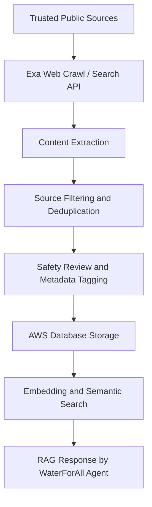
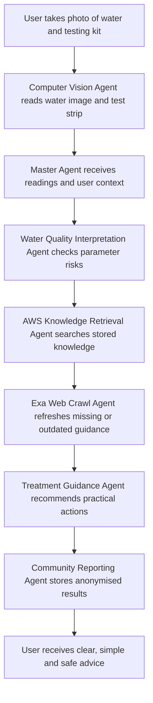

### Proposed Scaffolding

```text
soar-water-quality-agent/
├── .env                                 # Secure environmental secrets (EXA_API_KEY, OPENAI_API_KEY, AWS_ACCESS_KEY_ID, AWS_SECRET_ACCESS_KEY)
├── .gitignore                           # Excludes local virtual environments and environmental secrets
├── agents.md                            # Master prompt and evaluation matrix answering criteria 1–9
├── Dockerfile                           # Multi-stage container instruction using uv for instant deployment
├── pyproject.toml                       # High-speed dependency configuration (torch, wntr, exa-py, boto3, pg8000)
├── uv.lock                              # Deterministic dependency tree mapping to ensure parity
├── README.md                            # Executive project overview and launch procedures
├── requirements.txt                     # Standard fallback dependency matrix mapping
│
├── data/
│   ├── raw/
│   │   └── water_potability.csv         # Baseline CSV data tracking node potability telemetry
│   ├── epanet/
│   │   └── network.inp                  # Static EPANET water distribution network configuration file
│   └── processed/                       # Cached matrices and cleaned execution sensor states
│
├── database/                            # Database schemas, migrations, and seed scripts
│   ├── schema.sql                       # Schema definitions for Knowledge, Rule, User Test, and Community Risk tables
│   └── seed_data.sql                    # Initial seed data for water safety rules and initial knowledge base
│
├── models/
│   ├── potability_model.pkl             # Serialized classical ML classification model checkpoint
│   └── weights.pth                      # Pre-trained PyTorch physics-informed neural network weights
│
├── src/
│   ├── app.py                           # Single-page interactive Streamlit operator dashboard
│   │
│   ├── agents/                          # Specialized Multi-Agent Layer
│   │   ├── master_agent.py              # Master Water Safety Agent coordinating sub-agents
│   │   ├── cv_agent.py                  # Computer Vision Agent reading water images and test strips
│   │   ├── interpretation_agent.py      # Water Quality Interpretation Agent mapping parameter risks
│   │   ├── aws_retrieval_agent.py       # AWS Knowledge Retrieval Agent searching RDS and OpenSearch
│   │   ├── exa_crawl_agent.py           # Exa Web Crawl Agent searching public sources for latest guidance
│   │   ├── treatment_agent.py           # Treatment Guidance Agent recommending practical actions
│   │   ├── community_agent.py           # Community Reporting Agent storing results and tracking area trends
│   │   ├── education_agent.py           # Education Agent explaining water safety concepts in simple language
│   │   └── safety_agent.py              # Safety and Compliance Agent preventing unsafe advice
│   │
│   ├── tools/                           # Modular Operational Tool Layer
│   │   ├── aws_rds_tool.py              # Tool to interface with Amazon RDS PostgreSQL
│   │   ├── aws_opensearch_tool.py       # Tool to interface with Amazon OpenSearch for vector embeddings
│   │   ├── aws_s3_tool.py               # Tool to store raw documents, images, and source snapshots in S3
│   │   ├── exa_tool.py                  # Exa Search/Crawl client wrapper
│   │   ├── cv_tool.py                   # Computer vision processing utility for test kits
│   │   ├── epanet_tool.py               # WNTR simulation wrapper interacting with the C-compiled binary
│   │   └── ml_model_tool.py             # Handles local evaluation calls to potability_model.pkl
│   │
│   └── pipelines/                       # Compute Automation & Ingestion Pipelines
│       ├── ingestion_pipeline.py        # Knowledge ingestion pipeline (crawling, extraction, review, storage)
│       └── run_water_quality_scenario.py # Deterministic end-to-end pipeline simulating anomalies
│
├── notebooks/                           # Experimental Research & Prototyping Sandboxes
│   ├── 01_train_potability_model.ipynb  # Exploratory data analysis and model training loops
│   └── 02_epanet_water_age_simulation.ipynb # Prototyping workspace for WNTR hydraulic evaluation
│
├── scripts/                             # Containerization and Lifecycle Automation Tools
│   ├── start-server.sh                  # Builds and spins up the local Docker container (Mac/Linux)
│   ├── start-server.bat                 # Builds and spins up the local Docker container (Windows)
│   ├── stop-server.sh                   # Gracefully deprovisions container infrastructure (Mac/Linux)
│   └── stop-server.bat                  # Gracefully deprovisions container infrastructure (Windows)
└── docs/
    └── plan.md                          # Primary implementation roadmap mapped with phase criteria
```

---

## Exa and AWS Knowledge Layer

A key part of WaterForAll is the safe drinking water knowledge base.

We will use Exa to crawl and retrieve trusted web content related to safe drinking water, household water treatment, emergency water safety, boiling guidance, filtration methods, test kit interpretation, chemical contamination warnings, and safe water storage. The crawler should prioritise authoritative sources such as WHO, CDC, UNICEF, government water agencies, public health departments, NGOs, and recognised humanitarian organisations.

The crawled content will not be used blindly. It will go through a knowledge ingestion pipeline before being stored in AWS.



The AWS database will act as the system’s source of truth for safe-drinking-water knowledge and user records.

For the MVP, the AWS architecture can be:

### Amazon S3
Stores raw crawled documents, images, test kit photos and source snapshots.

### Amazon RDS PostgreSQL
Stores structured knowledge, rules, source metadata, user test results, locations, risk levels and audit logs.

### Amazon OpenSearch Service
Stores vector embeddings for semantic search and RAG retrieval.

### AWS Lambda or ECS
Runs ingestion jobs, Exa crawl jobs, data cleaning and agent backend logic.

### Amazon API Gateway
Exposes backend APIs to the frontend app.

### Amazon Bedrock or external LLM API
Generates user-friendly explanations using retrieved knowledge.

---

### Database Schema Design

The database should store both structured and unstructured knowledge.

#### Knowledge table:
- source title
- source URL
- organisation name
- country or region
- topic category
- content summary
- full extracted text
- last crawled date
- safety confidence score
- approved / pending / rejected status

#### Water safety rule table:
- condition
- risk level
- recommended action
- warning message
- source reference
- human review status

#### User test result table:
- anonymised user ID
- test kit type
- parameter readings
- image confidence score
- water appearance classification
- recommended action
- timestamp
- approximate location, if user consents

#### Community risk table:
- area
- repeated unsafe readings
- common parameter failures
- trend over time
- escalation recommendation

This allows the master agent to give advice that is not just based on the LLM’s general knowledge, but based on retrieved, cited, curated and stored public health knowledge.

---

## Updated Agent Architecture

The system will be designed as a master water safety agent supported by specialised sub-agents.



The full set of agents includes:

### 1. Master Water Safety Agent
Coordinates all agents and produces the final user-friendly recommendation.

### 2. Computer Vision Agent
Reads the water test kit, detects water appearance, checks image quality and estimates confidence.

### 3. Water Quality Interpretation Agent
Maps test kit readings to simple categories such as safe, caution, unsafe or requires laboratory testing.

### 4. AWS Knowledge Retrieval Agent
Searches the stored safe drinking water knowledge base in Amazon RDS and OpenSearch.

### 5. Exa Web Crawl Agent
Searches and crawls trusted public sources when the database does not have enough information or when guidance needs updating.

### 6. Treatment Guidance Agent
Suggests practical next steps such as settling, filtering, boiling, safe storage, or avoiding the water.

### 7. Community Reporting Agent
Stores anonymised results and identifies repeated unsafe readings in the same area.

### 8. Education Agent
Explains water safety concepts in simple language.

### 9. Safety and Compliance Agent
Prevents the system from giving unsafe advice, such as saying chemically contaminated water is safe after boiling.
