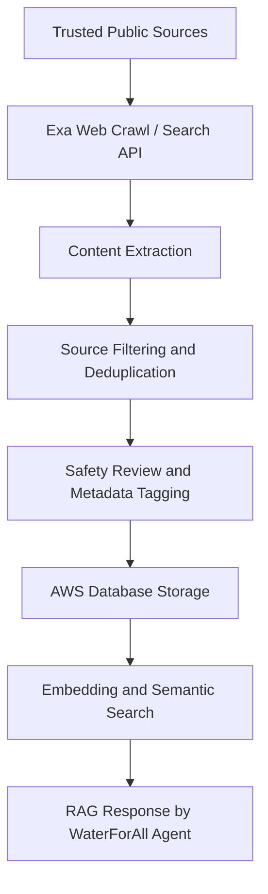
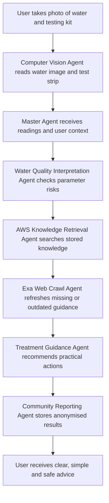

# WaterForAll: Agentic Water Safety Assistant with Exa Web Crawl and AWS Knowledge Database

## Project Overview

WaterForAll is a low-cost, AI-assisted water safety assistant for communities that do not have frequent or reliable access to clean drinking water. The solution combines affordable drinking water test kits, mobile phone photos, computer vision, agentic AI, Exa web crawling, and an AWS-hosted knowledge database.

The aim is to help users perform first-level water safety checks, understand possible risks, and receive practical next-step guidance such as filtering, boiling, safe storage, or escalating for proper laboratory testing.

---

## Problem Statement

Many communities lack easy access to laboratories, trained water operators, continuous sensors, or formal water treatment systems. Instead, they rely on wells, rivers, rainwater collection, storage tanks, temporary supply points, or delivered water. 

Even if water looks clear, it may still contain harmful microorganisms or chemical contaminants. At the same time, advanced testing equipment is often expensive or unavailable.

---

## How It Works

WaterForAll addresses this by utilizing cheap and widely available drinking water testing kits:
1. The user dips a test strip or uses a simple reagent-based kit.
2. The user takes a photo of the water sample and the test kit result.
3. The system uses computer vision to interpret color changes on the test strip, compare them against a reference color chart, and estimate basic water quality parameters such as pH, chlorine residual, turbidity, nitrate, nitrite, hardness, iron, and other locally relevant indicators.
4. Computer vision also analyzes the appearance of the water itself to detect if the water appears clear, cloudy, colored, or visibly contaminated with particles. 

While this does not replace proper laboratory testing, it provides an invaluable first-level screening tool for communities with limited access to water quality information.

---

## Exa and AWS Knowledge Layer

A key part of WaterForAll is the safe drinking water knowledge base. 

Exa is used to crawl and retrieve trusted web content related to safe drinking water, household water treatment, emergency water safety, boiling guidance, filtration methods, test kit interpretation, chemical contamination warnings, and safe water storage. The crawler prioritizes authoritative sources such as WHO, CDC, UNICEF, government water agencies, public health departments, NGOs, and recognized humanitarian organizations.

The crawled content is processed through an ingestion pipeline before being stored in AWS.

---

## AWS Infrastructure & Database Schema Design

The AWS database acts as the system’s source of truth for safe-drinking-water knowledge and user records.

### AWS Architecture for the MVP and Final Deployment
- **Amazon API Gateway**: Routes frontend requests to the backend services securely in the final deployment.
- **Amazon S3**: Stores raw crawled documents, images, test kit photos, and source snapshots.
- **Amazon RDS PostgreSQL**: Stores structured knowledge, rules, source metadata, user test results, locations, risk levels, and audit logs. (MVP will use a robust local PostgreSQL Docker container).
- **Amazon OpenSearch Service**: Stores vector embeddings for semantic search and RAG retrieval.
- **AWS Lambda or ECS**: Runs ingestion jobs, Exa crawl jobs, data cleaning, and agent backend logic.
- **Amazon Rekognition**: Used for Computer Vision to read water test kits and assess water clarity.
- **Amazon Bedrock or external LLM API**: Generates user-friendly explanations using retrieved knowledge, orchestrated via LangGraph.

### Database Tables

The database stores both structured and unstructured knowledge.

#### Knowledge Table
- source title
- source URL
- organisation name
- country or region
- topic category
- content summary
- full extracted text
- last crawled date
- safety confidence score
- approved / pending / rejected status

#### Water Safety Rule Table
- condition
- risk level
- recommended action
- warning message
- source reference
- human review status

#### User Test Result Table
- anonymised user ID
- test kit type
- parameter readings
- image confidence score
- water appearance classification
- recommended action
- timestamp
- approximate location, if user consents

#### Community Risk Table
- area
- repeated unsafe readings
- common parameter failures
- trend over time
- escalation recommendation

Every recommendation can be traced back to stored knowledge, source metadata, and safety rules, rather than relying solely on the LLM's general knowledge.

---

## Updated Agent Architecture

The system is designed as a master water safety agent supported by specialized sub-agents, orchestrated using **LangGraph**.

### Specialized Agents

1. **Master Water Safety Agent**: Coordinates all agents and produces the final user-friendly recommendation.
2. **Computer Vision Agent**: Reads the water test kit, detects water appearance, checks image quality, and estimates confidence.
3. **Water Quality Interpretation Agent**: Maps test kit readings to simple categories such as safe, caution, unsafe, or requires laboratory testing.
4. **AWS Knowledge Retrieval Agent**: Searches the stored safe drinking water knowledge base in Amazon RDS and OpenSearch.
5. **Exa Web Crawl Agent**: Searches and crawls trusted public sources when the database does not have enough information or when guidance needs updating.
6. **Treatment Guidance Agent**: Suggests practical next steps such as settling, filtering, boiling, safe storage, or avoiding the water.
7. **Community Reporting Agent**: Stores anonymized results and identifies repeated unsafe readings in the same area.
8. **Education Agent**: Explains water safety concepts in simple language.
9. **Safety and Compliance Agent**: Prevents the system from giving unsafe advice, such as saying chemically contaminated water is safe after boiling.

---

## Example User Flow

1. A user collects water in a clean transparent container, places the used test strip beside the reference color chart, and takes a photo.
2. The **Computer Vision Agent** reads the test strip and detects that the water is cloudy.
3. The **Water Quality Interpretation Agent** identifies possible water quality concerns.
4. The **AWS Knowledge Retrieval Agent** searches the stored safe-drinking-water knowledge base for relevant guidance.
5. If the knowledge base does not have enough information for that country or context, the **Exa Web Crawl Agent** retrieves additional guidance from trusted sources and stores it in AWS.
6. The **Master Agent** generates a simple, actionable recommendation:
   > Your water appears cloudy and the test result suggests caution.
   > 
   > Recommended steps:
   > 1. Let visible particles settle.
   > 2. Filter the clearer water using a clean cloth or suitable household filter.
   > 3. Boil the water before drinking if microbial contamination is suspected.
   > 4. Store treated water in a clean covered container.
   > 
   > Warning:
   > If there is suspected chemical, fuel, pesticide, industrial, or heavy metal contamination, do not rely on boiling. Use another water source and seek proper testing.

---

## Technical Details

- Containerized architecture using Docker Compose, including a robust local PostgreSQL container to emulate Amazon RDS.
- Use uv as the ultra-fast package manager for the Python FastAPI backend, managing LangGraph and other dependencies.
- Use structured outputs in JSON format especially across multiple agents and APIs.
- Integrate the Exa API securely using environment variables to fetch external real-time context.
- Leverage Amazon Rekognition via API for all Computer Vision tasks.
- Frontend built with **Next.js, React, and Tailwind CSS** for a highly polished, elegant corporate-utility UI.

## Color Scheme

- Water Blue Primary: #209dd7

## Strategy

1. Write plan with success criteria for each phase to be checked off. Include project scaffolding, Dockerfile configuration using uv, virtual environment setup, and basic validation testing for model loading and API client configuration.
2. Execute the plan ensuring all criteria are met
3. Carry out extensive integration testing with localhost or Playwright, fixing UI defects and rendering pipeline anomalies
4. Only complete when the MVP is finished and tested, with the containerized server running locally and ready for the user

## Coding Standards

1. Use latest versions of libraries and idiomatic approaches as of today
2. Keep it simple - NEVER over-engineer, ALWAYS simplify, NO unnecessary defensive programming. No extra features - focus on simplicity.
3. Be concise. Keep README minimal. IMPORTANT: no emojis ever
4. When hitting issues, always identify root cause before trying a fix. Do not guess. Prove with evidence, then fix the root cause.

---

## Technical Architecture

### Frontend Web Application
- Built with Next.js, React, and Tailwind CSS.
- Upload water image and test kit image.
- Show results, conversational UI, and advice.
- Show community risk dashboard.

### Backend API
- Built with FastAPI.
- Receives image and user input.
- Orchestrates agents via LangGraph.
- Calls Amazon Rekognition for computer vision.
- Stores results in the local PostgreSQL container (simulating AWS RDS).
- **Amazon API Gateway**: Used in the final deployment to route traffic securely to the backend.

### Computer Vision Layer
- Powered by **Amazon Rekognition**.
- Test strip color detection and reference chart comparison.
- Water clarity detection and image quality confidence score.

### Agentic AI Layer
- Master Water Safety Agent
- Water Quality Agent
- Treatment Guidance Agent
- AWS Knowledge Retrieval Agent
- Exa Web Crawl Agent
- Community Reporting Agent

### Knowledge Layer
- Exa crawls trusted web sources
- Raw content stored in Amazon S3
- Structured knowledge stored in Amazon RDS PostgreSQL
- Embeddings stored in Amazon OpenSearch
- Safety rules stored in database tables

### Analytics Layer
- Community-level unsafe water trends
- Repeated parameter failures
- Location-based risk hotspots
- Reports for NGOs or local agencies